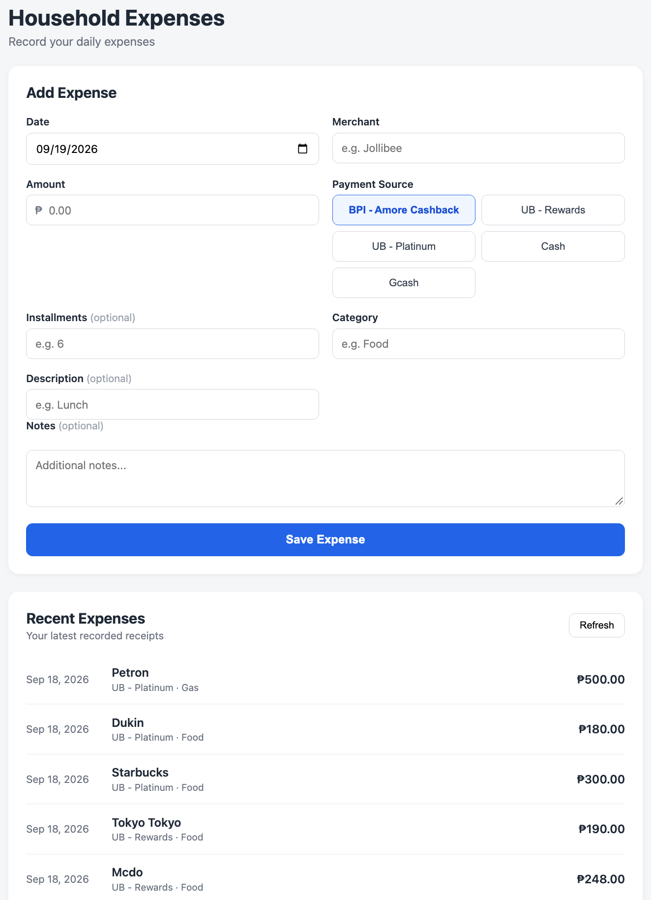
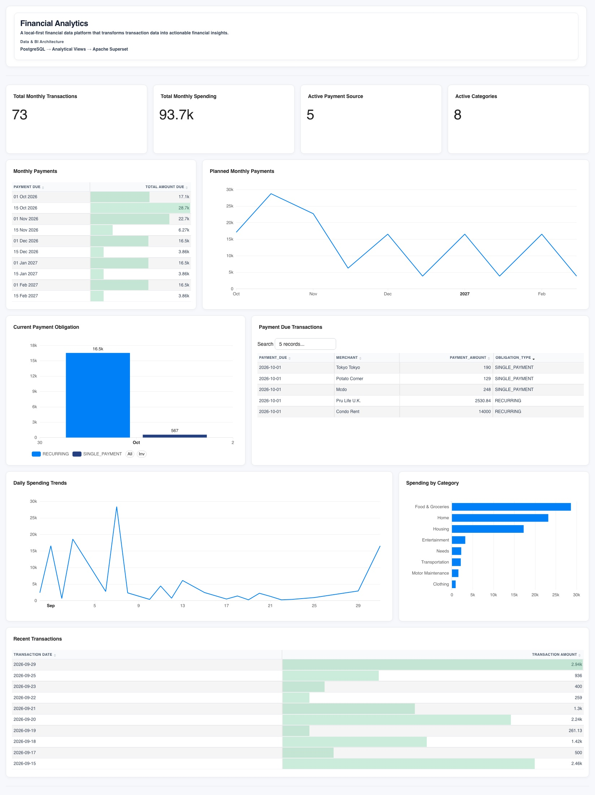
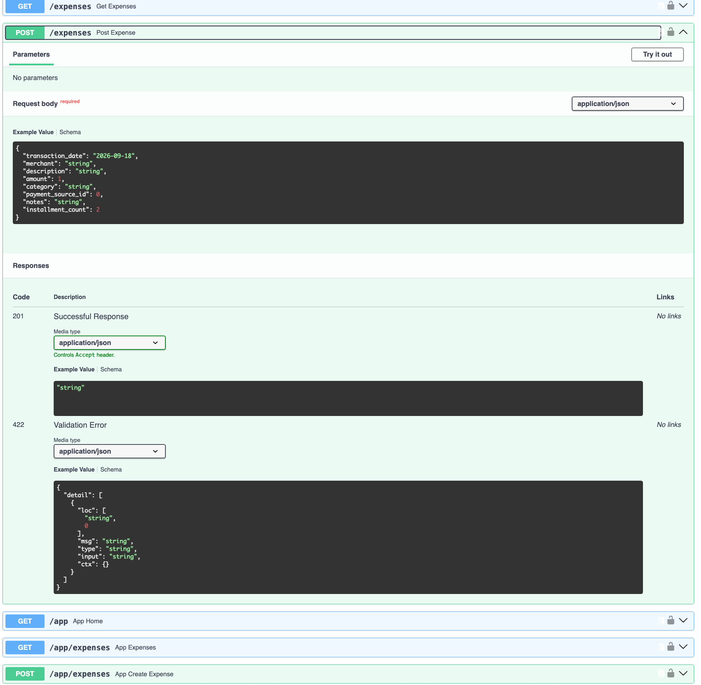

# Finance Data Platform

A self-hosted **household financial data platform** for capturing, storing, modeling, and analyzing financial transaction data using PostgreSQL, FastAPI/Python, SQL, and Apache Superset.

## Why I Built This

Financial transactions are often scattered across different sources, making it difficult to maintain a consistent and structured view of spending.

This project addresses that problem by separating **transaction capture, data storage, payment processing, and analytics** into distinct layers.

The goal is to create a simple but extensible foundation where transaction data can be captured through an application, stored reliably in PostgreSQL, and analyzed through purpose-specific analytical datasets.

Apache Superset is the current reporting and visualization platform for the project.

## Project Snapshot

| Area | Implementation |
|---|---|
| Purpose | Household financial data capture, modeling, and analytics |
| Architecture | Web Application → FastAPI → PostgreSQL → Analytical Views → Apache Superset |
| Primary Database | PostgreSQL |
| Backend | Python / FastAPI |
| Frontend | HTML / CSS / JavaScript |
| Analytics & Visualization | Apache Superset |
| Current Milestone | Recurring Expenses & Transaction Obligation Model |

## What I Built

The platform currently provides:

- A web interface for transaction capture
- A FastAPI backend for request handling and validation
- PostgreSQL as the structured data layer and source of truth
- Relational data modeling for transactions, payment sources, credit cards, installment relationships, and recurring commitments
- Optional credit-card installment scheduling
- Database-controlled installment payment-date and allocation logic
- Database-controlled recurring schedule generation and future-dated transaction materialization
- A payment-obligation semantic layer covering single-payment, installment, and recurring payment obligations
- PostgreSQL analytical views for reporting and visualization
- Apache Superset as the current reporting and visualization platform
- Application authentication and API authentication
- A documented data model, system architecture, API, analytics layer, and technical decisions

The project demonstrates practical implementation across **data modeling, backend/API development, financial-domain business logic, data integrity, analytical modeling, and reporting/visualization**.

## Architecture

```text
                    Finance Data Platform

User
 |
 v
Web Application
(HTML / CSS / JavaScript)
 |
 v
FastAPI
 |
 v
PostgreSQL
 |
 +-- Operational Tables
 |     |
 |     +-- transactions
 |     +-- payment_sources
 |     +-- credit_cards
 |     +-- installment_plans
 |     +-- installment_schedule
 |     +-- recurring_expenses
 |     +-- recurring_schedule
 |
 +-- Payment Semantic Layer
 |     |
 |     +-- payment_obligations
 |
 +-- Analytical Views
       |
       +-- vw_transactions
       +-- vw_monthly_payments
               |
               v
       Apache Superset
       (Reporting & Visualization)
```

### Data Flow

1. A transaction is entered through the web application.
2. FastAPI receives and validates the transaction.
3. The validated transaction is stored in PostgreSQL.
4. For eligible credit-card transactions, an optional installment request can be submitted.
5. PostgreSQL creates the installment plan and derived installment schedule using the database-controlled installment process.
6. The `payment_obligations` layer represents the applicable payment obligations for single-payment credit-card transactions, installment transactions, and recurring-generated transactions.
7. PostgreSQL analytical views provide datasets for reporting and visualization.
8. Apache Superset consumes the analytical views for reporting and visualization.

The original transaction remains the source of truth for the spending event. Installment records represent derived payment obligations rather than additional purchases.

### Recurring Expenses

Recurring expenses are implemented as bounded financial commitments that generate scheduled occurrences and future-dated transaction records.

The implemented flow is:

```text
recurring_expenses
        |
        v
AFTER INSERT trigger
        |
        v
recurring_schedule
        |
        v
future-dated transactions
        |
        v
payment_obligations
        |
        v
analytical views / Superset
```

Creating a recurring expense causes the database-controlled recurring process to generate its bounded schedule and materialize the corresponding future-dated transaction records.

The generated transactions use the scheduled payment date as their `transaction_date` and are classified using:

```text
obligation_type = RECURRING
```

The recurring schedule maintains its relationship to the recurring definition through `recurring_id`. The current implementation does not maintain a persistent foreign-key relationship between `recurring_schedule` and generated transactions.

Apache Superset is the current reporting and visualization platform.

## Technology Stack

| Layer | Technology |
|---|---|
| Frontend | HTML, CSS, JavaScript |
| Application | Python, FastAPI |
| Database | PostgreSQL |
| Analytics & Visualization | Apache Superset |
| Database Driver | psycopg |
| Authentication | HTTP Basic Authentication / Bearer API Token |

## Database Design

The platform separates original spending events from derived payment information.

### Core Data Model

- `transactions` — original financial spending events and generated future-dated recurring transaction records
- `payment_sources` — reusable payment-source reference data
- `credit_cards` — credit-card-specific reference information
- `installment_plans` — relationship between an original transaction and an installment plan
- `installment_schedule` — derived installment payment allocations
- `recurring_expenses` — bounded recurring financial commitments
- `recurring_schedule` — scheduled occurrences generated from recurring definitions
- `payment_obligations` — payment-obligation semantic layer for single-payment, installment, and recurring obligations

Transactions use the system-derived `obligation_type` classification:

- `NORMAL` — normal non-recurring transaction
- `SINGLE_PAYMENT` — credit-card transaction without installments
- `RECURRING` — transaction generated from a recurring expense
- `INSTALLMENT` — credit-card transaction associated with an installment plan

The `obligation_type` value is derived by the system and is not a user-controlled frontend field.

### Analytical Views

PostgreSQL provides purpose-specific analytical views used by Apache Superset:

- `vw_transactions` — transaction-level dataset enriched with the human-readable payment source name and `obligation_type`
- `vw_monthly_payments` — aggregated payment-level dataset based on resolved `payment_obligations`

The analytical views provide reporting-oriented datasets without replacing the operational tables.

`vw_monthly_payments` uses the resolved `payment_due` from `payment_obligations` rather than reconstructing payment timing from credit-card reference data.

## Credit-Card Installments

The V1 Credit-Card Installments implementation is the project's primary example of financial-domain business logic and database-controlled processing.

The platform supports optional 0% credit-card installment plans while preserving the original purchase as the spending source of truth and deriving installment payment obligations separately.

The design follows this flow:

```text
Original Transaction
        |
        v
Installment Plan
        |
        v
Installment Schedule
        |
        v
Payment Obligations
        |
        v
Monthly Payment Analytics
```

The database controls:

- Credit-card eligibility
- Authoritative transaction amount
- First installment payment-date calculation
- Installment schedule generation
- Monetary allocation and rounding reconciliation
- Payment-obligation representation

The application invokes the database-controlled installment process but does not independently calculate installment payment dates or allocation logic.

V1 currently supports:

- Credit-card transactions only
- 0% interest
- Optional installment creation
- Deterministic installment allocation
- Exact reconciliation to the original transaction amount

The current implementation does not include:

- Generalized interest or amortization calculations
- Installment refunds or cancellation
- Installment modification
- Automatic historical conversion of existing transactions
- Cash-flow forecasting
- Universal payment obligations across all payment types

## Application

The FastAPI application handles:

- Transaction creation
- Transaction retrieval
- Request validation
- Authentication
- Database connectivity
- Optional credit-card installment creation
- Transactional commit and rollback behavior

The API accepts an optional `installment_count` when creating a transaction.

When an installment request is submitted, the application creates the original transaction and invokes `create_installment_plan()` within the same database transaction.

Recurring expenses are currently created through the database-controlled recurring process rather than through a dedicated recurring-expense CRUD API in the application.

Recurring-generated transactions are retained in the canonical `transactions` table but are excluded from the application's normal recent-expense display.

If installment creation fails, the transaction is rolled back.

See [`docs/api.md`](docs/api.md) for the API design and endpoint documentation.

## Analytics and Reporting

The current analytics architecture uses PostgreSQL analytical views as the interface between the operational database and Apache Superset.

### `vw_transactions`

Used for transaction-level reporting and visualization, including:

- Total Transactions
- Used Payment Source
- Categorical Transactions
- Daily Expenses

The view also exposes `obligation_type`, allowing downstream reporting to distinguish normal, single-payment, recurring, and installment transaction records.

### `vw_monthly_payments`

Used for monthly payment reporting.

It consumes the current `payment_obligations` semantic layer and provides aggregated payment-level information for Superset using the resolved `payment_due`.

Recurring-generated transactions participate in the existing analytical layer through `payment_obligations`, `vw_transactions`, and `vw_monthly_payments`. A dedicated recurring-expense analytical view or dedicated recurring Superset dashboard is not currently part of the implementation.

### Current Reporting Flow

```text
PostgreSQL
    |
    +-- transactions
    |       |
    |       +-- vw_transactions
    |
    +-- payment_obligations
            |
            +-- vw_monthly_payments
                     |
                     v
              Apache Superset
                     |
                     v
            Reporting & Visualization
```

### Project Screenshots

The repository includes screenshots of the implemented application and reporting layers.

#### Web Application



#### Financial Intelligence Dashboard



#### FastAPI Application



See [`docs/analytics.md`](docs/analytics.md) for the analytical view contracts and current Superset dataset mapping.

## Security & Data Handling

This project is designed as a self-hosted application.

Key practices include:

- Credentials stored outside the source code
- `.env` excluded from version control
- Local database dumps excluded from version control
- Parameterized SQL queries
- Application and API authentication
- HTTP security headers

No personal financial transaction data is included in the public repository.

## Repository Structure

```text
app/                    FastAPI application
database/               Database schema and database logic
static/                 Frontend JavaScript and CSS
templates/              HTML templates
screenshots/            Application and reporting screenshots
docs/                   Architecture and technical documentation
requirements.txt        Python dependencies
.env.example            Example environment configuration
```

## Documentation

- [`Architecture`](docs/architecture.md) — system architecture, layers, and data flow
- [`Data Model`](docs/data-model.md) — database structure, installment model, recurring model, and payment-obligation semantics
- [`Analytics`](docs/analytics.md) — analytical views and Superset dataset usage
- [`API Documentation`](docs/api.md) — API endpoints, transaction creation, and installment flow
- [`Technical Decisions`](docs/technical-decisions.md) — key technology and architecture decisions

## Current Status

The V1 Credit-Card Installments, Category Standardization, and Recurring Expenses & Transaction Obligation Model implementations have been completed and verified.

The current implementation includes:

- Transaction capture and retrieval
- Credit-card installment scheduling
- Database-controlled payment-date and installment allocation logic
- Recurring expense schedule generation
- Future-dated recurring transaction materialization
- System-derived transaction obligation classification
- Payment-obligation semantics for single-payment, installment, and recurring transactions
- Transaction-level analytical reporting
- Monthly payment reporting
- Apache Superset visualization

The current project phase is documentation and final project-state alignment.

The platform provides a foundation for structured financial transaction data and payment-level analytics while remaining extensible for future financial use cases.

### Project Direction

Future development can extend the platform toward:

- More comprehensive financial analytics
- Additional transaction sources
- Data transformation and validation workflows
- Expanded reporting capabilities
- Additional automation around transaction processing
- More advanced financial insights
- Future recurring-expense management capabilities such as explicit correction or deletion lineage

Recurring expenses are implemented functionality. The current V1 model uses bounded recurring definitions, generated schedules, and future-dated transaction materialization through the database-controlled recurring process.

Future capabilities should be treated as planned extensions rather than current functionality unless implemented and documented.

---

Built as a personal data engineering and analytics project.
